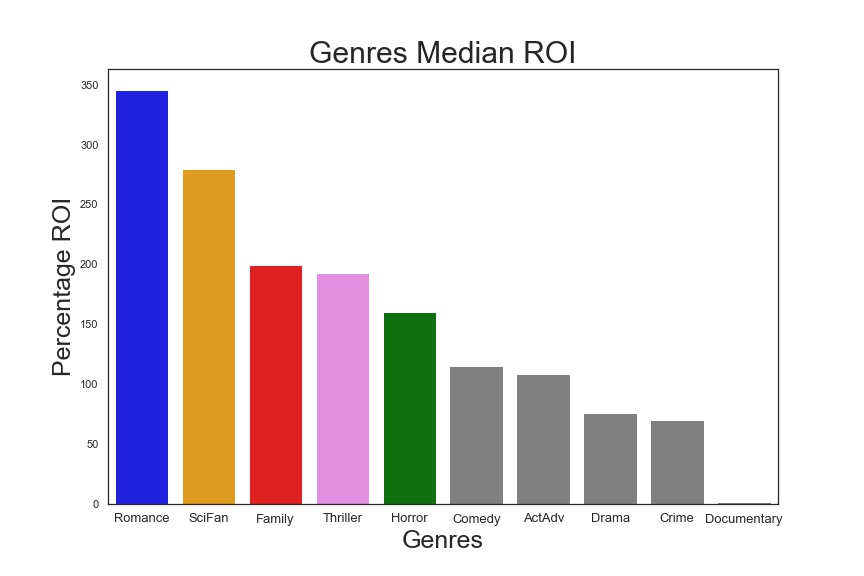
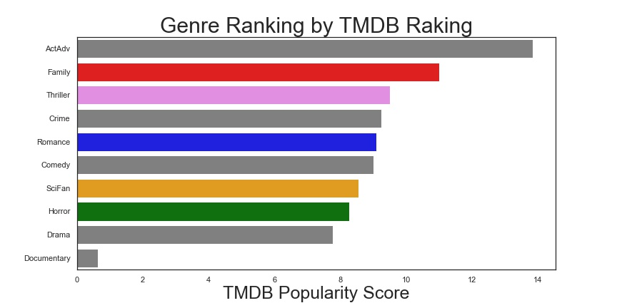
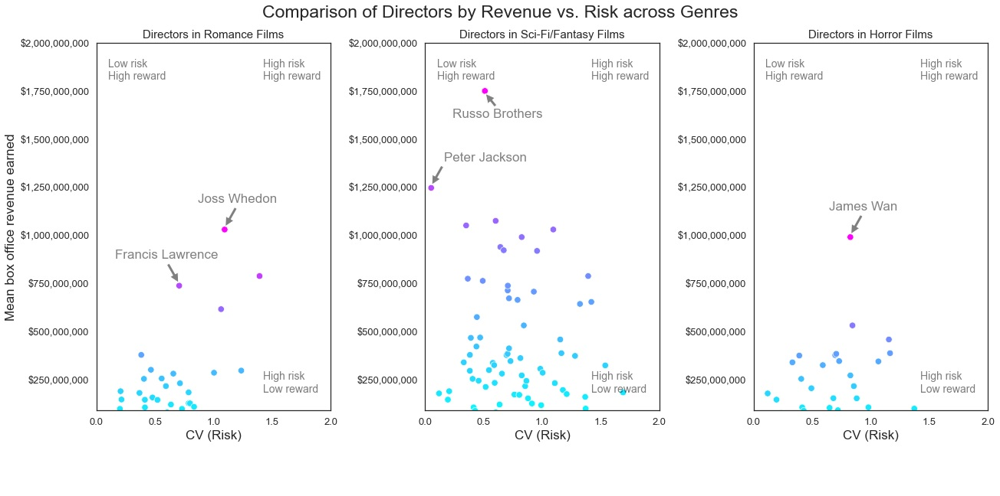

# Flatiron Data Science Course - Project 1
### Created by Nick Hall, Clay Hunn, and Ahmad Samiee
##### Cohort DS-NATL-080822
&nbsp; 
## <b/>To do <i/>before</i> running any code:</b>
<ul/> 
  <li><b/>Download</b> the following three files in <a/ href="https://github.com/learn-co-curriculum/dsc-phase-1-project-v2-4/tree/master/zippedData">this GitHub repository</a> into a subfolder named "data".
    <ul/>
      <li>im.db.zip</li>
      <li>tmdb.movies.csv.gz</li>
      <li>tn.movie_budgets.csv.gz</li>
    </ul>
  </li>
  <li><b/>Unzip</b> "im.db.zip".</li>
</ul>

After these steps, all .ipynb and .py files should run without issue.

&nbsp;
<h1/>Project Overview</h1>

In this project we will perform exploratory data analysis to provide feedback to a stakeholder.
Data visualization will be used as a tool to deliver our recommendation.

## Master Datasets
The master dataset is split into two. The first is used for analysis of ROI in different genre and movie rating indicator and takes data from:
<ul/>
  <li>im.db</li>
  <li>tmdb.movies.csv.gz</li>
  <li>tn.movie_budgets.csv.gz</li>
</ul>

The second is used for analysis of ROI to movie people and takes data from:
<ul/>
  <li>im.db</li>
  <li>tmdb.movies.csv.gz</li>
</ul>

## Reading data files and merge data

The database files are read into Pandas DataFrames. The DataFrames are merged into in two data DataFrames, one for analysis of genre to ROI and also for analysis of genre to rating popularity, and another for analysis of movie staff and their risk.

## Data cleaning & engineering
After the dataframes were merged, columns not needed for analysis were dropped. A row/record was dropped if one of the relevant cell columns had a nan value. Also, any record before the 2000 were dropped for purposes of keeping the data relevant to current time. Data type for some columns were converted from object to integer or datetime in order to perform analysis. Some columns were added for calculation puposes or extracting a specific value from anotehr column.

## Data visualization and analysis
Genre Comparison to ROI

Genre Comparison to Rating

Genre to Movie People

## Conclusion
* According to return on investment (ROI) analysis romance, science-fiction/fantasy and
   family are most promising in creating video content. 
 * The Movie Database(TMDB) rating analysis shows that family, thriller and science-
   fiction/fantasy are among the top five rated genres. This aligns with how the genre are
   with ROI. It is therefore a moderate indicator how a particalar genre performs
   financially.
 * For analysis of key content creaters (directors, writeres and actors) the recommendation for directors are as follows:   
    - For sci-fi and fantasy films, top two picks are the Russo brothers and Peter Jackson.
    - For romance, top two picks are Joss Whedon and Francis Lawrence. 
    - For horror, James Wan

