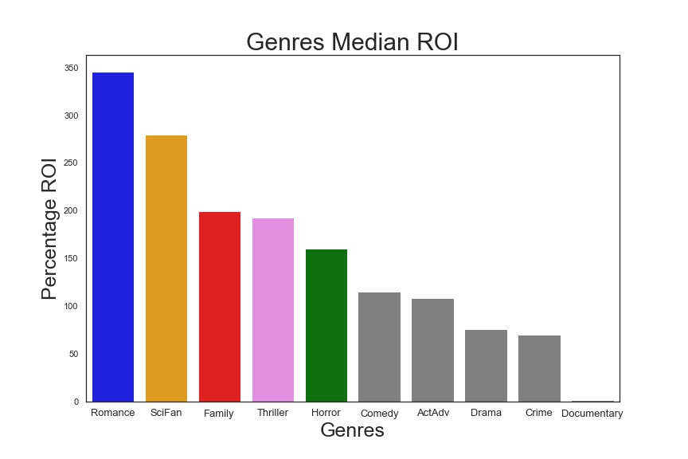
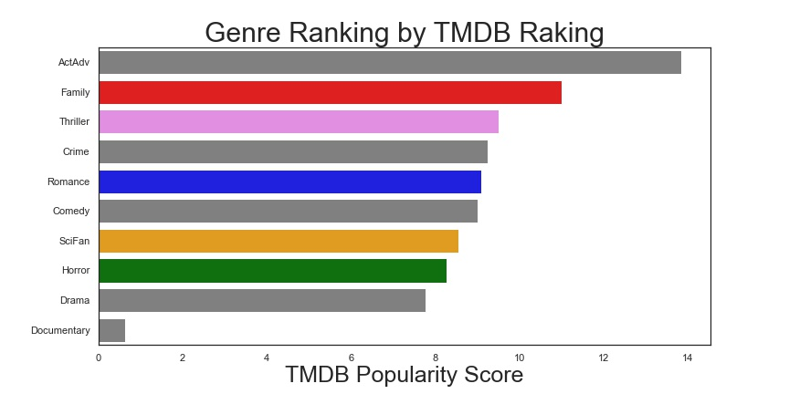

# Flatiron Data Science Course - Project 1
### Created by Nick Hall, Clay Hunn, and Ahmad Samiee
##### Cohort DS-NATL-080822
&nbsp; 
## <b/>To do <i/>before</i> running any code:</b>
<ul/> 
  <li><b/>Download</b> the following three files in <a/ href="https://github.com/learn-co-curriculum/dsc-phase-1-project-v2-4/tree/master/zippedData">this GitHub repository</a> into a subfolder named "data".
    <ul/>
      <li>im.db.zip</li>
      <li>tmdb.movies.csv.gz</li>
      <li>tn.movie_budgets.csv.gz</li>
    </ul>
  </li>
  <li><b/>Unzip</b> "im.db.zip".</li>
</ul>

After these steps, all .ipynb and .py files should run without issue.

&nbsp;
<h1/>Project Overview</h1>

In this project we will perform exploratory data analysis to provide feedback to a stakeholder.
Data visualization will be used as a tool to deliver our recommendation.

## Master Datasets
The master dataset is split into two. The first is used for analysis of ROI in different genre and movie rating indicator and takes data from:
<ul/>
  <li>im.db</li>
  <li>tmdb.movies.csv.gz</li>
  <li>tn.movie_budgets.csv.gz</li>
</ul>

The second is used for analysis of ROI to movie people and takes data from:
<ul/>
  <li>im.db</li>
  <li>tmdb.movies.csv.gz</li>
</ul>

## Reading data files and merge data

The database files are read into Pandas dataframes. The dataframes are merged into in two data dataframe, one for analysis for analysis of genre to ROI and also for analysis of genre to rating popularity. The second dataframe is used to analyze movie people to ROI.

## Data cleaning & engineering
Columns not needed for analysis are dropped. Convert 'production_budget', 'domestic_gross', 'worldwide_gross' to integer and 'release_date' to datetime object. Create a new column called 'Assigned_genre_ids' and assign to it the first number of 'genre_ids' and covert this to integer. Drop rows where 'genre_ids' cell is empty and drop rows if production_budget, domestic_gross or worldwide_gross has a value of zero. Remove rows with release date less than 2000. Drop duplicated rows. Create a dictionary called 'genre_ids_dict' with key assocaited with 'Assigned_genre_ids' and values with writtten genre name. Then, create a column called 'Assigned_genre_name' and use the dictionary to input written genre name with the respective key. Then combine low number genres to a genre closely similar. Two additional columns are created for 'Pofit' and 'ROI' calculation. Create a dataframe called 'genre_ratings_df' by copying 'movie_basics_ratings_tmdb_tn_df' and rearrange columns so related columns placed close to one another.

## Data visualization and analysis
Genre Comparison to ROI

Genre Comparison to Rating

Genre to Movie People

## Conclusion

